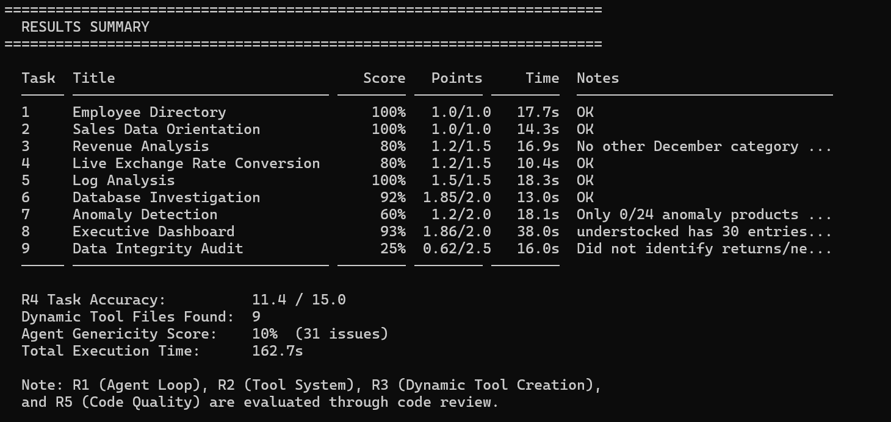

# ai_exercise_task

# Prompt Strategy for LLM Tool Generation

## Problem

Using a **single generic prompt** for all tasks (CSV, JSON, Logs, DB, multi-source) caused:

* Wrong schema assumptions
* Hardcoded logic
* Empty / partial outputs
* Failure in strict evaluation (exact metrics, formats)

**Conclusion:** Fully generic prompting is not sufficient for deterministic tasks.

---

## Key Insight

```
More generic  → Less accurate
More specific → Less scalable
```

**The solution is not choosing one — but combining both.**

---

## Solution: Hybrid Prompting

We use a **layered prompt architecture**:

```
BASE RULES (generic reasoning)
+ FILE DISCOVERY
+ TASK-SPECIFIC CONSTRAINTS
```

---

## Architecture

```
+--------------------------------------------------------------+
|                         User Task                            |
+------------------------------+-------------------------------+
                               |
                               v
+--------------------------------------------------------------+
|                    AgentOrchestrator                         |
|              LangGraph-based control flow                    |
+------------------------------+-------------------------------+
                               |
                               v
+--------------------------------------------------------------+
|                        RulesAgent                            |
| Detects task pattern and loads matching rule files           |
+------------------------------+-------------------------------+
                               |
                               v
+--------------------------------------------------------------+
|                        ReuseAgent                            |
| Checks whether an existing generated tool can be reused      |
+-------------------+------------------------------------------+
                    | yes
                    v
              +-----------+
              | Execute   |
              +-----------+
                    |
                    | no reusable tool
                    v
+--------------------------------------------------------------+
|                  ToolGenerationAgent                         |
| Builds prompt = generic base + selected rules                |
| Generates Python tool() with GPT-4o                          |
+------------------------------+-------------------------------+
                               |
                               v
+--------------------------------------------------------------+
|                    ExecutionAgent                            |
| Runs generated code and captures result or error             |
+-------------------+----------------------+-------------------+
                    | success              | failure
                    v                      v
          +------------------+   +----------------------------+
          |   StorageAgent   |   |          FixAgent          |
          | Saves tool file  |   | Repairs code with GPT-4o   |
          +------------------+   +-------------+--------------+
                                                |
                                                v
                                      +------------------+
                                      | Retry Execution  |
                                      +------------------+
                                                |
                                  +-------------+-------------+
                                  | success                   | fail
                                  v                           v
                           +--------------+              +-----------+
                           | save + end   |              | end/error |
                           +--------------+              +-----------+
```

---

## Core Idea

Instead of writing a different prompt per task, we:

1. Detect **task intent**
2. Attach **relevant rule blocks**
3. Enforce **hard output constraints where needed**

---

## Routing Strategy

```python
# Routing
if "dashboard" in t or "cross-source" in t or "multiple" in t:
    rules_block = FILE_DISCOVERY_RULES + MULTI_SOURCE_RULES

elif "audit" in t or "integrity" in t or "quality" in t:
    rules_block = FILE_DISCOVERY_RULES + AUDIT_RULES

elif ".db" in t or "sqlite" in t or "database" in t:
    rules_block = DB_RULES

elif ".log" in t or "log" in t:
    rules_block = FILE_DISCOVERY_RULES + LOG_RULES

elif "anomaly" in t:
    rules_block = FILE_DISCOVERY_RULES + ANOMALY_RULES

elif "exchange" in t or "currency" in t or "usd" in t:
    rules_block = FILE_DISCOVERY_RULES + CURRENCY_OUTPUT_RULES

else:
    rules_block = FILE_DISCOVERY_RULES
```

---
## Results



The system achieved **11.4 / 15.0** R4 Task Accuracy with **9 dynamically generated tool files**.

Strong results were achieved in:
- Employee Directory — 100%
- Sales Data Orientation — 100%
- Log Analysis — 100%
- Database Investigation — 92%
- Executive Dashboard — 93%

The main weaknesses remain in **Anomaly Detection (60%)** and **Data Integrity Audit (25%)**.

These results demonstrate a working dynamic tool-generation agent that performs well on most core data tasks.